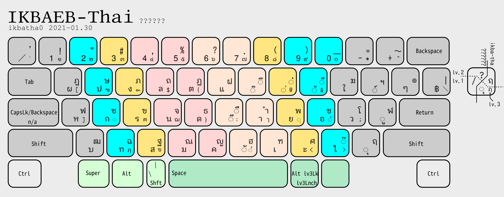

NOTE:
This keyboard layout is still in progress.
Unstable and may be changed several times .
You could check the new one in `wip_test` branch.
Old version available in `%DATE%ver` folders.

# IKBAEB-th - Thai keyboard layout

`IKBAEB-th` (Thai: อี๊กแบ็บ, <small>pronounced </small>[\[íːkbɛ̀p\]](https://en.wikipedia.org/wiki/Help:IPA/Thai), [iikᴴ-baepᴸ](http://thai-language.com/ref)) is an alternative Thai keyboard layout unlike [Kedmanee (เกษมณี)](https://en.wikipedia.org/wiki/Thai_Kedmanee_keyboard_layout) or [Pattachote (ปัตตะโชติ)](https://en.wikipedia.org/wiki/Thai_Pattachote_keyboard_layout).

This layout optimized for:

- Less stress on the right pinky reducing pain
- Finger-rolling combos inspired by [Colemak](https://colemak.com/)
- Maintaining Arabic numeral row for everyday typing, with the lesser-used Thai numerals under [AltGr](https://en.wikipedia.org/wiki/AltGr_key) in the same order
- etc.

# NAME

The name IKBAEB originates from the Thai word, อีกแบบ, meaning _another_ ~ _alternative_. However "อีกแบบ" is too ordinary, so it will be be called "อี๊กแบ็บ".

`ikbatha0` was short name for compatible with [8.3 filename](https://en.wikipedia.org/wiki/8.3_filename).

> However, there is an opinion that language names are more important than layout names.
> Therefore, I decided dropped 2 unnecessary letter from name, `IKBA-Thai`, If spaces were insufficient and the IME didn't display language input.

# SUGGEST

I prefer shift-key on thumb location. 

Use something like [xkeysnail](https://github.com/mooz/xkeysnail) to make [Dual-role keys](https://en.wikipedia.org/wiki/Modifier_key#Dual-role_keys) ([`space-bar`and`shift`](https://poyo.hatenablog.jp/entry/2018/06/23/020147#SandS)) if you don't have `extra shift` key.  

# License

The keyboard layout, the implementations, and the downloadable things are available under the [**Public domain**](LICENSE)
except the components in [`AnySoftKeyboard folder`](android/anysoftkeyboard) which released under the [Apache2](https://www.apache.org/licenses/LICENSE-2.0) license same as AnySoftKeyboard.

Android is a trademark of Google Inc.

Windows is registered trademarks of Microsoft Corporation.
