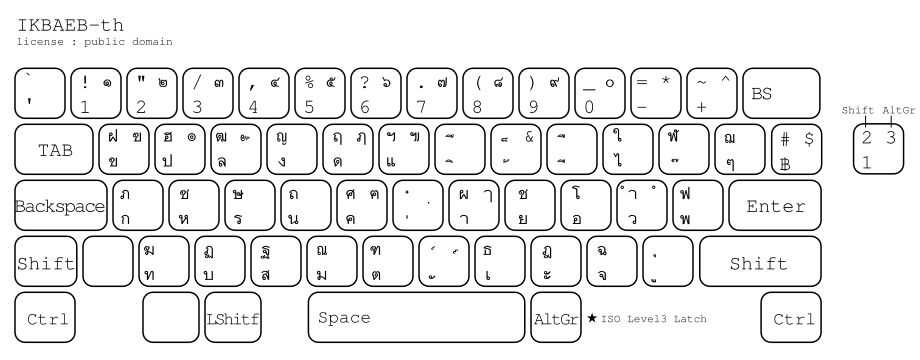

[Testing new rearrange layout here](https://gitlab.com/hiohlan/ikbaeb-th)

# IKBAEB-th - Thai keyboard layout

`IKBAEB-th` (Thai: อี๊กแบ็บ, <small>pronounced </small>[\[íːkbɛ̀p\]](https://en.wikipedia.org/wiki/Help:IPA/Thai), [iikᴴ-baepᴸ](http://thai-language.com/ref)) is an alternative Thai keyboard layout unlike [Kedmanee (เกษมณี)](https://en.wikipedia.org/wiki/Thai_Kedmanee_keyboard_layout) or [Pattachote (ปัตตะโชติ)](https://en.wikipedia.org/wiki/Thai_Pattachote_keyboard_layout).

This layout optimized for:

- Less stress on the right pinky reducing pain
- Finger-rolling combos inspired by [Colemak](https://colemak.com/)
- Maintaining Arabic numeral row for everyday typing, with the lesser-used Thai numerals under [AltGr](https://en.wikipedia.org/wiki/AltGr_key) in the same order
- etc.

The name IKBAEB originates from the Thai word, อีกแบบ, meaning _alternative_. However "อีกแบบ" is too ordinary, so it will be be called "อี๊กแบ็บ".
