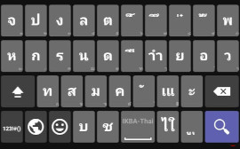
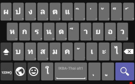
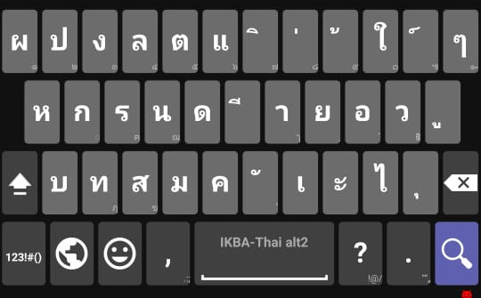

# AnySoftKeyboard


IKBAEB-Thai layouts for [AnySoftKeyboard](https://github.com/AnySoftKeyboard/AnySoftKeyboard) keyboard app.

This is an expansion layouts pack for AnySoftKeyboard.
Install AnySoftKeyboard first, and then select the desired layout from AnySoftKeyboard's Settings->Keyboards menu.

NOTE:
They work with AnySoftKeyboard v1.10-r4 and above.
v1.10-r3 and below, shift-state bug. [^1]

# Pros & Cons
Pros
- Interesting
- Use only 3 Rows (+ 1 Spacebar row)

Cons
- Finger travel is terrible.

# How to build.
1. [Requirements](https://github.com/AnySoftKeyboard/AnySoftKeyboard/blob/master/CONTRIBUTING.md).
1. [AnySoftKeyboard](https://github.com/AnySoftKeyboard/AnySoftKeyboard) sourcecode. They cannot build addon by standalone.
1. Put `ikbatha` folder in `%AnySoftKeyboard%/addons/languages/` .
1. Add the new modules to Gradle. Edit settings.gradle, add the line:
```
include ":addons:languages:ikbatha:pack", ":addons:languages:ikbatha:apk"
```
1. Build an APK that can be installed on your device:
```
./gradlew :addons:languages:ikbatha:apk:assembleDebug
```

NOTE:
1. [How to create a Language-Pack](https://github.com/AnySoftKeyboard/AnySoftKeyboard/blob/master/addons/CONTRIBUTING.md), For more information. 
1. There is no ~~stupid~~ dictionary file included.
(They can share dictionary data with AnySoftKeyboard's default Thai package)


# To do
- [ ] more described.
- [ ] Clean code.
- [ ] Usefull dictionary.
- [ ] Physical keyboard that actually works.
- [ ] custom symbols keybord that match Thai orthography.
- [ ] Merge to Thai keyboard series.

# License
The components in this `AnySoftKeyboard folder` are modified from [AnySoftKeyboard's Thai Language addon pack](https://github.com/AnySoftKeyboard/AnySoftKeyboard/tree/master/addons/languages/thai)
which released under the [Apache2](https://www.apache.org/licenses/LICENSE-2.0) license.

`IKBEAB-th` layout itself is public domain *and* the components (sourcecode, image file, etc) in this `AnySoftKeyboard folder` released under the [Apache2](https://www.apache.org/licenses/LICENSE-2.0) license same as AnySoftKeyboard.

    Copyright 2020 Menny Even-Danan
    
    Licensed under the Apache License, Version 2.0 (the "License");
    you may not use this file except in compliance with the License.
    You may obtain a copy of the License at
    
    http://www.apache.org/licenses/LICENSE-2.0
    
    Unless required by applicable law or agreed to in writing, software
    distributed under the License is distributed on an "AS IS" BASIS,
    WITHOUT WARRANTIES OR CONDITIONS OF ANY KIND, either express or implied.
    See the License for the specific language governing permissions and
    limitations under the License.

[^1]: - https://github.com/AnySoftKeyboard/AnySoftKeyboard/issues/443 - https://github.com/AnySoftKeyboard/AnySoftKeyboard/pull/2367
