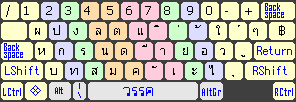
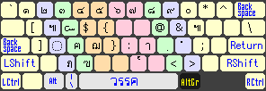

# keyboard layout for Windows.

1 methods:

- PKL for Portable Keyboard Layout. Using without having to install them. Required download: http://pkl.sourceforge.net/ 

# suggest 
~~Intaller - Mapped `left-alt` to `shift` using something like [SharpKeys](https://github.com/randyrants/sharpkeys).~~
OR [SandS (Space and Shift)](https://en.wikipedia.org/wiki/Modifier_key#Dual-role_keys).

# PKL

1. Download things in pkl folder

1. Place `IKBAEB-th` folder in `%YOURPKL%\layouts\`

1. In `pkl.ini` set "layout = IKBAEB-th" & "suspendHotkey = LAlt & Shift".

1. Run `pkl.exe` and enjoy.
